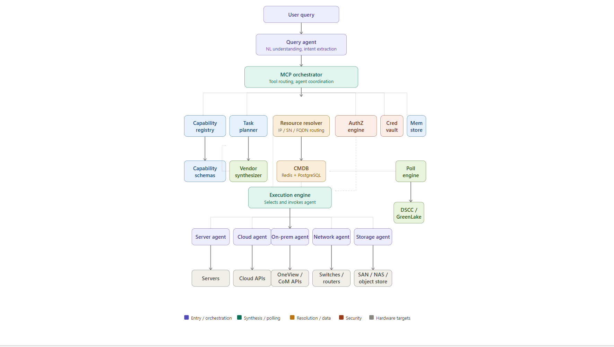

# Stratum : Agentic AIOps for Hyperscale Infrastructure

Stratum is a vendor-agnostic Agentic AI platform that transforms enterprise infrastructure operations into a conversational experience. Using MCP orchestration, semantic operational agents, and adaptive capability intelligence, Stratum enables users to manage servers, storage, networking, and hybrid infrastructure through natural language interactions. The platform dynamically discovers and normalizes heterogeneous vendor APIs into standardized operational capabilities, allowing seamless execution across cloud and on-prem environments. Stratum introduces morphing agents and semantic operational meshes that continuously adapt execution behavior based on topology, runtime state, operational risk, and infrastructure context. The system evolves operational intelligence over time through autonomous capability synthesis, topology-aware reasoning, and self-optimizing infrastructure cognition.

---

## Table of Contents

* [Why Stratum?](#why-stratum)
* [Architecture Overview](#architecture-overview)
* [What Makes Stratum Unique?](#what-makes-stratum-unique)
* [Key Capabilities](#key-capabilities)
* [Architectural Decisions](#architectural-decisions)
* [Core Components](#core-components)
* [Agent Ecosystem](#agent-ecosystem)
* [Mock Infrastructure Environment](#mock-infrastructure-environment)
* [Runtime Topology](#runtime-topology)
* [Service Ports](#service-ports)
* [Request Execution Flow](#request-execution-flow)
* [Resource Resolver Subsystem](#resource-resolver-subsystem)
* [CMDB Design](#cmdb-design)
* [Database Architecture](#database-architecture)
* [Capability-Driven Execution](#capability-driven-execution)
* [Security and Governance](#security-and-governance)
* [Observability](#observability)
* [API Examples](#api-examples)
* [Repository Structure](#repository-structure)
* [Getting Started](#getting-started)
* [Running the Platform](#running-the-platform)
* [Development Workflow](#development-workflow)
* [Testing](#testing)
* [Example Scenarios](#example-scenarios)
* [Enterprise Use Cases](#enterprise-use-cases)
* [Design Principles](#design-principles)
* [Future Roadmap](#future-roadmap)
* [Contributing](#contributing)

---

## Why Stratum?

Traditional datacenter and cloud infrastructure management relies on static scripts, pre-baked playbooks (e.g., Ansible, Terraform), and fragmented management dashboards. While these tools automate repetitive actions, they struggle under the complexities of modern, hyperscale hybrid environments:

1. **Heterogeneous Infrastructure Complexity**: Modern datacenters host bare-metal systems (HPE ProLiant, Synergy), multi-vendor switches (Cisco, Aruba), storage arrays (HPE Alletra, SAN/NAS), and multi-cloud instances (AWS, Azure, GCP). Operating this hybrid footprint requires developers to learn and integrate dozens of disparate APIs.
2. **Brittle Vendor-Specific APIs**: Legacy systems are bound to specific orchestrators. For example, local physical servers might require HPE OneView REST calls, whereas cloud-managed environments rely on HPE Compute Ops Management (COMS) APIs. If a resource migrates or a vendor shifts, scripts break due to hardcoded endpoint structures.
3. **High Operational Friction**: When SREs or infrastructure administrators need to perform a diagnostic check or execute power actions, they must manually locate the management controller IP, extract credentials from vaults, look up API endpoints, and structure HTTP requests.
4. **Lack of Autonomy (Playbooks vs. Agents)**: Traditional automation is imperative; it executes fixed steps without understanding the underlying system topology, live sensor state, environment context (e.g., production vs. dev), or runtime restrictions.

**Stratum** addresses these challenges by moving from static automation to **Agentic AIOps**. By combining the Model Context Protocol (MCP) with domain-specific execution agents, Stratum abstracts vendor-specific quirks into dynamic, capability-driven operations. Instead of writing code to interface with OneView or Redfish, operators express natural language intents (e.g., *"check memory utilization on server dc1-a7"*), leaving it to Stratum to resolve the target, verify permission, match capabilities, and route the command.

---

## Architecture Overview

Stratum is designed around a decoupled, microservice-based architecture that leverages Model Context Protocol (MCP) to bridge LLM orchestrators (like Claude Desktop) with physical or virtual infrastructure.

### High-Level Architecture Flow

```
[ User Query ]
      │
      ▼
[ MCP Server (mcp_server.py) ]
      │
      ├── Authentication & Identity Mapping (Roles JSON / OAuth)
      ├── Intent Parsing & Decomposing (Task Planner & Query Agent)
      ├── Resource Routing (Resource Resolver: Redis Cache / PostgreSQL CMDB)
      ├── Policy Validation (RBAC Engine & ABAC Engine)
      │
      ▼
[ Execution Engine (AgentDispatcher) ] ── (Queries Capability Registry)
      │
      ├── [ Server Agent ]   ──► [ iLO Mock / Compute Ops Mock ]
      ├── [ Storage Agent ]  ──► [ Storage Mock API ]
      ├── [ Network Agent ]  ──► [ Network Mock API ]
      └── [ Cloud Agent ]    ──► [ Cloud Mock API ]
```

### Technical Architecture Explanation

1. **API / MCP Layer**: Acts as the interface gateway. The unified MCP server (`mcp_server.py`) exposes tools directly to the AI orchestrator. It intercepts natural language commands and returns formatted, execution-ready insights.
2. **Authentication & Authorization**: Decodes identity tokens and queries local policy engines. The RBAC engine evaluates OneView-based role permissions against target resource categories, while the ABAC engine restricts environment (e.g., production limits) and operational timeframes.
3. **Task Planner**: Decomposes complex, multi-action natural language statements into individual task entities with defined execution dependencies.
4. **Resource Resolver & CMDB**: Isolates the target hardware. It matches query tokens (serial numbers, IPs, FQDNs) against a PostgreSQL registry (or Redis cache for hot-path lookup) to identify the target controller FQDN, device category, and REST endpoint template.
5. **Capability Registry**: A centralized FastAPI registry where agents register their capabilities on startup. The execution engine queries this service to discover which agent can fulfill a given task type and action.
6. **Execution Engine (Dispatcher)**: Orchestrates task distribution. It queries the Capability Registry, normalizes the target payload, and POSTs the structured request to the resolved agent.
7. **Domain-Specific Agents**: Dedicated microservices (Server, Storage, Network, Cloud, On-Prem) that wrap vendor protocols (Redfish, SNMP, IPMI, S3) and translate standardized tasks into raw API calls.
8. **Vendor APIs / Mock Servers**: Simulated local environments mimicking HPE OneView, iLO, DSCC, Cisco switches, and AWS/Azure APIs to allow secure sandbox validation.



---

## What Makes Stratum Unique?

Unlike standard automation frameworks, Stratum introduces features tailored for hyperscale infrastructure:

* **Capability-Driven Routing**: Instead of routing by hardcoded hostnames or IP addresses, Stratum routes by *capability*. If an agent exposes the `server.execute.power_action` capability, the system automatically routes power requests to it, regardless of whether it manages a bare-metal server or a virtual machine.
* **Semantic Operational Agents**: Microservices register themselves with OASF-compliant JSON manifests specifying their domain, resource types, and supported skillsets. The orchestrator queries this dynamic registry at runtime to select the best target.
* **Dynamic Endpoint Resolution**: The Resource Resolver retrieves the exact URL template from the PostgreSQL `endpoint_registry` based on the vendor, device type, and action. Changes in vendor API paths are solved by updating the database schema rather than changing application code.
* **Double-Caching Resolution Mesh**: Caching lookups on Redis bypass PostgreSQL queries entirely for high-frequency queries, warming the cache dynamically on misses.
* **Infrastructure Cognition**: Combining ABAC and natural language parsing allows the system to refuse critical commands in production environments during off-hours, enforcing guardrails natively.

---

## Key Capabilities

* **Natural Language Operations (NL-Ops)**: Perform complex datacenter modifications (e.g., `"set power to Off for dev-sw-01 and then update the firmware"`) via chat.
* **Dynamic Resource Resolution**: Auto-translate random identifiers (IPs, Serials, FQDNs) to a unified device record and destination REST path.
* **Capability-Driven Execution**: Register and discover microservice capabilities dynamically using the OASF registry, enabling zero-downtime agent upgrades.
* **Vendor-Agnostic Agent Abstraction**: Uniformly manage Redfish BMCs, HPE OneView enclosures, DSCC storage volumes, and cloud resources.
* **Multi-Domain Infrastructure Management**: Direct support for Compute (Bare-metal/Blade), Network (Switch/VLAN), Storage (SAN/NAS/S3), and Hybrid Cloud.
* **Mock Infrastructure Simulation**: Built-in SQLite databases and mock REST APIs to replicate production management servers locally.
* **Extensible Agent Framework**: Simple adapter-plugin system to register new hardware adapters (e.g., Netconf, SNMP, IPMI) in minutes.

---

## Architectural Decisions

### 1. Centralized Resource Resolver vs. Decoupled Routing
* **Decision**: We centralize resource resolution inside a single SQL/Redis engine rather than distributing routing logic to individual agents.
* **Rationale**: Distributed routing requires each agent to maintain a full system topology and database sync. A centralized Resource Resolver abstracts location complexity; agents remain stateless and only execute tasks targeting IDs they are explicitly passed.
* **Trade-off**: The Resource Resolver becomes a single point of failure. This is mitigated by high-availability PostgreSQL clusters and Redis replication layers in production.

### 2. Double-Caching Caching Strategy (Redis + PostgreSQL)
* **Decision**: All device lookups query Redis first. On a cache miss, the system queries PostgreSQL, warms Redis, and returns the record with a default 900s TTL.
* **Rationale**: Querying PostgreSQL on every natural language token lookup introduces database latency. Caching normalized `DeviceRecord` JSONs under keys like `resolver:sn:<serial>` provides sub-millisecond lookups.
* **Trade-off**: Potential cache desynchronization. We resolve this by having the `PollingEngine` force-update the cache on every sync run.

### 3. Domain-Separated Execution Agents
* **Decision**: Agents are packaged as independent microservices separated by infrastructure domain (Server, Storage, Network, Cloud) rather than a monolith.
* **Rationale**: Domain separation allows developers to write specialized adapter plugins (e.g., using python-redfish or Netconf libraries) without bloated dependency graphs. It also enables horizontal scaling of agents based on infrastructure density.
* **Trade-off**: Multi-service startup overhead, resolved using orchestrators like Kubernetes or start scripts.

### 4. PostgreSQL CMDB as the Source of Truth
* **Decision**: PostgreSQL maintains the definitive state of the hardware registry, audit trails, and endpoint schemas.
* **Rationale**: Enforces relational constraints (e.g., unique serial numbers) and supports transaction isolation, preventing concurrent updates or duplicates.
* **Trade-off**: Requires database administration, setup, and initialization.

---

## Core Components

| Component | Purpose | Responsibilities | Inputs | Outputs | Dependencies |
| :--- | :--- | :--- | :--- | :--- | :--- |
| **Task Planner** | Parses natural language into ordered tasks. | Preprocess query; split on conjunctions; build dependent tasks. | Raw text string. | List of `Task` objects. | `QueryAgent` |
| **Resource Resolver** | Resolves device identities to targets. | Route lookup; type inference; cache management; URL synthesis. | Identifier string, action. | `RouteResolution` JSON. | `PostgreSQL`, `Redis` |
| **Capability Registry** | Dynamic agent directory. | Stores agent locators; performs capability-based lookups. | `AgentRecord` JSON. | Registry match payload. | Memory store |
| **Execution Engine** | Task routing pipeline. | Map actions; check OASF skills; construct agent payloads. | Query action, target device. | Dict response. | `Capability Registry` |
| **Agent Dispatcher** | Dispatches requests to agents. | Select agent; construct task requests; send POST payload. | `Task` parameters, locator. | Executed task status JSON. | `httpx` client |
| **Authentication Layer** | Session security wrapper. | Decodes token claims; maps identities; handles SSO login. | OAuth token. | Email, Role strings. | Auth0, Local Store |
| **CMDB Layer** | Central inventory store. | Manages hardware records, poll history, and metadata. | SQL Queries. | Rows/dicts. | `psycopg2` |
| **Endpoint Registry** | Static API path catalog. | Stores HTTP methods and URL paths per action. | Vendor, type, action query. | SQL endpoint record. | PostgreSQL Table |
| **Polling Engine** | Background inventory sync. | Query managers; reconcile PostgreSQL; warm Redis. | Poll interval trigger. | Reconciled counts. | Database/Cache layers |

---

## Agent Ecosystem

Stratum features a vendor-agnostic agent ecosystem designed around **OASF (Open Agentic Specification for Frameworks)** capability models.

### 1. Server Agent
* **Purpose**: Manages bare-metal compute resources. Bypasses high-level orchestrators to query hardware BMCs.
* **Supported Operations**: `fetch_metrics` (sensor/thermal logs), `execute_action` (power control: ON, OFF, RESET), `fetch_event_log` (SEL logs), `inventory` extraction.
* **Supported Resources**: Bare-metal servers, BMC modules, sensors, firmware images, and system event logs.

### 2. Storage Agent
* **Purpose**: Coordinates storage arrays, SANs, and file shares.
* **Supported Operations**: `fetch_capacity`, `fetch_performance`, `volume_action` (create/delete/modify volumes), `discover_arrays`.
* **Supported Resources**: Storage systems, pools, volumes, LUNs, buckets, and snapshot groups.

### 3. Network Agent
* **Purpose**: Manages fabric switches and routers.
* **Supported Operations**: `discover_topology`, `fetch_metrics` (interface statistics), `execute_config_push`.
* **Supported Resources**: Switches, routers, interface cards, VLAN segments, and routing sessions.

### 4. Cloud Agent
* **Purpose**: Operates multi-cloud endpoints.
* **Supported Operations**: `fetch_metrics` (compute/memory loads), `health_check`, `discover_resources`, `execute_action` (instance control).
* **Supported Resources**: VMs, containers, functions, buckets, and cloud network interfaces.

### Vendor-Agnostic Design & Capability Execution
Each agent abstracts vendor details through a pluggable adapter pattern:
1. The **Agent Core** defines abstract base classes for operations.
2. Developers implement **Adapter Plugins** (e.g., `dscc_adapter`, `oneview_adapter`, `aws_adapter`) mapping base methods to raw API calls.
3. The orchestration layer communicates using generic OASF **Skills** (e.g., `storage.execute.volume_action`), ensuring that swapping an underlying storage array does not affect user-facing tools.

---

## Mock Infrastructure Environment

To facilitate offline development, testing, and CI/CD pipelines, Stratum bundles a complete mock infrastructure layer:

* **Mock Server (iLO & Compute Ops)**: Listens on ports `8010` (iLO Redfish) and `8001` (COMS). Simulates Redfish collections for Systems, Chassis, and Managers. Replicates server metrics, thermal sensors, power states, and boot configs using an SQLite store (`ilo_db.sqlite`).
* **Mock Storage (DSCC)**: Listens on port `8004`. Simulates HPE GreenLake Data Services Cloud Console (DSCC) endpoints, providing mock REST APIs for volume creation, storage pools, performance telemetry, and system stats.
* **Mock Network**: Listens on port `8002`. Replicates Cisco/Aruba switches, virtual interfaces, traffic speeds, and network topology structures.
* **Mock Cloud**: Listens on port `8003`. Replicates public cloud providers, allowing mock VMs to be created, read, updated, and deleted.

### Integration with Agents & Testing
Agents are configured via environment variables to route requests to the Mock Servers (e.g., `MOCK_STORAGE_URL` or `MOCK_SERVER_URL`). Because the mock endpoints output the exact REST schemas expected from live environments, agents execute standard parsing, mapping, and error-handling logic without modifications, supporting robust validation.

---

## Runtime Topology

```
                  [ Claude Desktop / Client ]
                             │
                             ▼ (Stdio / SSE)
                    [ MCP Server (8001) ]
                             │
            ┌────────────────┼────────────────┐
            ▼                ▼                ▼
     [ Auth0 SSO ]  [ Postgres CMDB ]   [ Redis Cache ]
      (dev-m8h0k)        (5432)            (6379)
                             │
                             ▼
                 [ Capability Registry ] (8020)
                             │
       ┌──────────────┬──────┴──────┬──────────────┐
       ▼ (8005)       ▼ (8006)      ▼ (8007)       ▼ (8009)
[ Cloud Agent ] [ Network Agent ] [ Storage Agent ] [ Server Agent ]
       │              │             │              │
       ▼ (8003)       ▼ (8002)      ▼ (8004)       ▼ (8010)
[ Mock Cloud ] [ Mock Network ]  [ Mock Storage ]  [ iLO Mock ]
```

---

## Service Ports

| Service | Protocol / Cwd | Default Port | Purpose |
| :--- | :--- | :--- | :--- |
| **Combined MCP Server** | FastMCP (STDIO / SSE) | *Dynamic* / `mcp_server` | Main client entry point. |
| **Capability Registry** | FastAPI | `8020` / `capability_registry` | Holds agent registrations and schemas. |
| **Mock OneView Server** | FastAPI / SQLite | `8000` / `mock_server(oneview)` | Simulates OneView hardware orchestrator. |
| **Mock Compute Ops** | FastAPI / SQLite | `8001` / `mock_server(Comops)` | Simulates SaaS Compute Ops Management. |
| **Mock Network API** | FastAPI / SQLite | `8002` / `mock_server(network)` | Simulates switch CLI & REST APIs. |
| **Mock Cloud API** | FastAPI / SQLite | `8003` / `mock_server(cloud)` | Simulates AWS EC2 & S3 endpoints. |
| **Mock Storage API** | FastAPI / SQLite | `8004` / `mock_server(storage)` | Simulates GreenLake DSCC API gateway. |
| **Mock iLO (Redfish)** | FastAPI / SQLite | `8010` / `mock_server(iLO)` | Simulates standard Redfish BMC interfaces. |
| **Cloud Agent** | FastAPI | `8005` / `agents/cloud_agent` | Resolves AWS/Azure/GCP tasks. |
| **Network Agent** | FastAPI | `8006` / `agents/network_agent` | Resolves SNMP & Netconf commands. |
| **Storage Agent** | FastAPI | `8007` / `agents/storage_agent` | Resolves DSCC & SAN/NAS tasks. |
| **On-Premise Agent** | FastAPI | `8008` / `agents/onprem_agent` | Bridges on-prem orchestrator tasks. |
| **Server Agent (iLO)** | FastAPI | `8009` / `agents/server_agent(iLO)` | Bridges direct bare-metal BMC tasks. |
| **PostgreSQL** | SQL Connection | `5432` | Authoritative CMDB store. |
| **Redis / Memurai** | TCP Connection | `6379` | High-performance cache database. |

---

## Request Execution Flow

Trace flow for the natural language command: **`"power off server compute-22"`**

```
1. Client (Claude) sends request "power off server compute-22" to Combined MCP Server.
2. Combined MCP Server invokes manage_infrastructure_resource(query="power off server compute-22").
3. Authentication check reads SSO login state; maps caller to role (e.g. "Server administrator").
4. Task Planner splits command, returning Task(action="OFF", identifier="compute-22", category="Operational").
5. Resource Resolver receives identifier "compute-22".
    ├── A. Checks Redis for key "resolver:sn:compute-22" (Cache Miss).
    ├── B. Queries PostgreSQL devices table: SELECT * FROM devices WHERE serial_number = 'compute-22'.
    ├── C. PostgreSQL returns record (IP: 10.11.99.5, management_source: mock_server, type: server).
    ├── D. Resolver synthesizes RouteResolution:
    │      ├── Invalidate & Warm cache: sets resolver:sn:compute-22 key.
    │      └── Synthesizes REST API path: /redfish/v1/systems/compute-22.
6. Authorization Check:
    └── Evaluates RBAC rules for "Server administrator": allowed "execute" on category "server-hardware". ABAC constraints checked (dev env: Pass; Time: Pass).
7. Capability Registry Query:
    └── GET /agents/lookup?resource_type=server&provider=mock_server resolves target agent: server-agent (Port 8009).
8. Execution Dispatcher:
    ├── A. Formats OASF task payload with task_id, action="execute_action", parameters={action_type: "power", state: "Off"}.
    └── B. Sends HTTP POST request to http://127.0.0.1:8009/server-agent/execute-task.
9. Server Agent Execution:
    ├── A. Receives task. Matches provider "mock_server" to the Redfish Adapter.
    ├── B. Adapter executes HTTP POST to Mock iLO Server (Port 8010) on /redfish/v1/systems/compute-22/Actions/ComputerSystem.Reset (State: Off).
    └── C. Mock iLO Server updates local sqlite database (sets power_state = "Off"), returning HTTP 200 OK.
10. Agent Dispatcher aggregates status, returns final execution report to Combined MCP Server, which displays result to the user.
```

---

## Resource Resolver Subsystem

The **Resource Resolver** maps generic text tokens and queries to exact operational targets. It consists of:

### 1. Intent Parsing & Preprocessing (`QueryAgent`)
Uses regular expression templates to extract clean search terms. For example, the query `"get health status of dc1-a7"` is mapped by:
```python
# Strip actions, returning the remaining clean identifier
action_patterns = [r"\bget\b", r"\bpower\b", r"\bhealth\b", r"\bstatus\b", r"\bof\b"]
```

### 2. Type Inference Engine
Infers the input format category to optimize index queries:
* **IP Address**: Matches `INET` regex patterns (e.g. `10.100.1.20`).
* **FQDN**: Matches hostname patterns containing dots (e.g. `node-01.mgmt.local`).
* **Serial Number**: Default category for alphanumeric tokens (e.g. `dc1-a7`).

### 3. Caching Strategy (Redis/Memurai)
* **Key Format**: `resolver:{type}:{token}` (all keys are forced to lowercase).
* **Write Pipeline**: When a record is resolved from the database, the resolver issues pipelined commands:
  ```redis
  SETEX resolver:sn:dc1-a7 900 "{\"id\":\"...\", \"serial_number\":\"dc1-a7\", ...}"
  SETEX resolver:ip:10.100.1.10 900 "{\"id\":\"...\", ...}"
  SADD resolver:source:oneview-01.mgmt.local dc1-a7
  EXPIRE resolver:source:oneview-01.mgmt.local 900
  ```

### 4. CMDB Fallback Resolution
On cache misses, the resolver queries indexes:
```sql
SELECT * FROM devices 
WHERE lower(serial_number) = $1 
   OR ip_address = $1 
   OR lower(fqdn) = $1 
LIMIT 1;
```

---

## CMDB Design

The PostgreSQL inventory store acts as the source of truth for device properties, routing endpoints, and telemetry audits.

```
                  ┌───────────────────────┐
                  │   endpoint_registry   │
                  │                       │
                  └───────────────────────┘
                  
                  ┌───────────────────────┐
                  │        devices        │
                  │                       │
                  └───────────┬───────────┘
                              │
                    ┌─────────┴─────────┐
                    ▼                   ▼
            ┌───────────────┐   ┌──────────────┐
            │ routing_audit │   │ poll_history │
            │               │   │              │
            └───────────────┘   └──────────────┘
```

* **`devices`**: Authoritative record of active devices and their respective management controllers. Unique index on `serial_number`. INET-typed column for `ip_address` ensures quick IP lookup.
* **`endpoint_registry`**: Catalogs mappings between vendor hosts, device types, action keys, and target REST endpoints. Supports dynamic parameters like `{id}`.
* **`routing_audit`**: Logs execution metadata (duration, cache hits, request identity) to audit system lookup health and trace latency anomalies.
* **`poll_history`**: Tracks sync runs. Stores quantities of added, modified, and removed devices.
* **`poll_snapshots`**: Reconciles inventory states across background threads using JSONB tracking sets.

---

## Database Architecture

Stratum decouples physical inventory tables from dynamic API endpoint definitions. It follows a normalized schema to support fast reads and clean data governance.

### Redfish Resource Normalization

Redfish schemas organize hardware into three main entities:
1. **Systems (ComputerSystems)**: Logical server nodes containing BIOS, processors, memory, and logical devices.
2. **Managers**: Management microcontrollers (BMCs/iLO boards) managing hardware health and interfaces.
3. **Chassis**: Physical sheets, racks, and enclosures holding fans, blades, and power supplies.

In Stratum, these entities are mapped back to a single `DeviceRecord` in the CMDB using:
* `source_device_id`: The hardware UUID generated by the remote manager.
* `device_type`: Maps resources to standard categories (e.g. `server`, `switch`, `storage`).

### Normalization Rationale
By consolidating nested Redfish properties (Systems, Managers, Chassis) into a flat `DeviceRecord` schema within PostgreSQL, the resource resolver remains lightweight. Domain-specific agents handle fetching additional Redfish sub-nodes dynamically on task execution, keeping lookups performant.

---

## Capability-Driven Execution

Capabilities allow new agents to add functionality without requiring database migrations or changes to core servers.

### 1. Capability Discovery
On server boot, agents load their `oasf_record.json` capability manifests and register them:
```bash
POST http://127.0.0.1:8020/agents
```

### 2. Resolution & Selection Flow
During task routing, the orchestrator asks the registry for an agent profile:
```http
GET http://127.0.0.1:8020/agents/lookup?resource_type=server&provider=mock_server
```
The registry executes hierarchical matching:
1. **Skill Match**: Matches explicit skill patterns (e.g., `server.execute.power_action`).
2. **Resource & Provider Match**: Perfect match on resource type and adapter protocol.
3. **Fallback Match**: Returns default agent mapping for that category.

---

## Security and Governance

Stratum is designed to satisfy strict enterprise security requirements:

* **Authentication (SSO Login)**: Integrates Auth0 out of the box. Users invoke `sso_login` to open a local browser window. Once authenticated, a secure OAuth token and claims payload are saved to `.auth_token`.
* **Role-Based Access Control (RBAC)**: Defined inside `roles.json` and evaluated via `rbac.py`. It matches user email claims to specific roles (`Network administrator`, `Storage administrator`, `Server administrator`, etc.) and restricts access based on resource categories.
* **Attribute-Based Access Control (ABAC)**: Evaluated inside `abac.py`. It adds conditional logic rules:
  * **Environment restriction**: Production modifications are restricted to `senior_admin`.
  * **Time lock**: Critical operations (`delete`, `execute`, `update`) are prohibited outside working hours (22:00 to 06:00) for standard roles.
  * **Vendor limits**: HPE resources require specific execution context.
* **Audit Trail**: Every routing resolution is logged directly to the `routing_audit` table. This preserves the identity, target device, cache performance, and lookup latency for SRE compliance analysis.

---

## Observability

* **Structured Logging**: Log entries (including API requests, database queries, and network dispatch transactions) are formatted into clean stdout messages and saved to `mcp.log` and `resolver.log`.
* **CMDB Sync Logging**: The PostgreSQL `poll_history` table records sync telemetry for auditing background daemon loops.
* **Health Checks**: Standard health checks (`/health` endpoints) are implemented across all agents and the capability registry, verifying connection states to external mock drivers.
* **Metrics Collection**: System stats and caching rates are gathered via fast lookup routes:
  * `cache_stats`: Displays Redis hit/miss rates.
  * `resolver_statistics`: Exposes database transaction counts and average resolution times.

---

## API Examples

### 1. Retrieve Device Status (Server Agent)
```bash
curl -X POST http://localhost:8009/server-agent/execute-task \
  -H "Content-Type: application/json" \
  -d '{
    "task_id": "api-task-001",
    "task_type": "monitoring",
    "resource_type": "server",
    "resource_id": "compute-22",
    "action": "fetch_metrics",
    "provider": "mock",
    "credentials_ref": "mock"
  }'
```
**Response**:
```json
{
  "task_id": "api-task-001",
  "status": "success",
  "metrics": {
    "power_state": "On",
    "health": "OK",
    "processors_count": 2,
    "memory_gb": 512,
    "temp_celsius": 42.5
  },
  "errors": []
}
```

### 2. Create Storage Volume (Storage Agent)
```bash
curl -X POST http://localhost:8007/storage-agent/execute-task \
  -H "Content-Type: application/json" \
  -d '{
    "task_id": "api-task-002",
    "task_type": "control",
    "resource_type": "volume",
    "resource_id": "vol-prod-09",
    "action": "execute_action",
    "provider": "mock_storage",
    "parameters": {
      "action_verb": "create",
      "capacity_gb": 500,
      "provisioning_type": "Thin"
    }
  }'
```
**Response**:
```json
{
  "task_id": "api-task-002",
  "status": "success",
  "metrics": {
    "volume_id": "vol-prod-09",
    "status": "Provisioned",
    "allocated_capacity_gb": 500
  },
  "errors": []
}
```

### 3. List Infrastructure Registry Devices (Resource Resolver Tool)
```bash
curl "http://localhost:8020/agents"
```

---

## Repository Structure

```
c:\AgenticAI_HPE
├── agents/                       # Agent microservices
│   ├── cloud_agent/              # Cloud metrics and VM execution agent
│   ├── network_agent/            # Switch configuration and SNMP topology agent
│   ├── onprem_agent/             # OneView high-level composable agent
│   ├── server_agent/             # Generic server adapter agent
│   ├── server_agent(iLO)/        # Core direct Redfish BMC iLO agent
│   └── storage_agent/            # DSCC, volume, and storage pool agent
├── authentication/               # SSO (Auth0, Okta, Azure Active Directory)
├── authorization/                # RBAC matrix models and ABAC rules engine
├── capability_registry/          # OASF agent profile database service
├── config/                       # Static routing rules and system parameters
├── execution_engine/             # Agent dispatcher routing client
├── mcp_server/                   # COMBINED MCP Server (FastMCP main wrapper)
├── mock_server(Comops)/          # Compute Ops Management REST Simulator
├── mock_server(cloud)/           # AWS/Azure SDK REST Simulator
├── mock_server(iLO)/             # direct hardware iLO Redfish Simulator
├── mock_server(network)/         # Cisco/Aruba REST Switch Simulator
├── mock_server(oneview)/         # HPE OneView Composable REST Simulator
├── mock_server(storage)/         # HPE GreenLake DSCC API Simulator
└── resource_resolver/            # DB-driven IP/SN lookup and endpoint registry
```

---

## Getting Started

### Prerequisites
* **Python 3.9+** (Ensure Python is added to the system PATH).
* **PostgreSQL** Server (v12+).
* **Redis** (or Memurai for local Windows development).

### 1. Database Setup
Create an empty database named `hpe_agentic_ai` in your local PostgreSQL instance.

### 2. Dependency Installation
Initialize a virtual environment and run the install script:
```bash
python -m venv env
env\Scripts\activate
pip install -r requirements.txt
```

### 3. Environment Configuration
Create a `.env` file in the root directory:
```ini
DB_HOST=localhost
DB_PORT=5432
DB_NAME=hpe_agentic_ai
DB_USER=postgres
DB_PASSWORD=your_secure_password
CACHE_TTL=900
```

---

## Running the Platform

### 1. Verify Postgres & Redis are Running
Ensure local PostgreSQL and Redis/Memurai servers are listening on standard ports (`5432` and `6379`).

### 2. Initialize and Seed the Database CMDB
Run the initialization scripts inside the `resource_resolver` directory (or use root script if paths are set):
```bash
# Initialize PostgreSQL schemas
python resource_resolver/db_manage.py init

# Seed mock hardware records
python resource_resolver/db_manage.py seed

# Register endpoint URL templates
python resource_resolver/seed_endpoint_registry.py
```

### 3. Start agents and mock environments
Launch the startup utility to spin up mock servers and OASF agents:
```bash
python start_services.py
```
This spawns all FastAPI applications on their dedicated ports.

### 4. Register MCP Server with Client
Open your Claude Desktop configuration file `claude_desktop_config.json`:
```json
{
  "mcpServers": {
    "stratum-ops": {
      "command": "python",
      "args": ["c:/AgenticAI_HPE/mcp_server/mcp_server.py"]
    }
  }
}
```
Restart Claude Desktop to load the tools.

---

## Development Workflow

### Adding a New Agent
1. Create a directory inside `agents/` (e.g. `firewall_agent`).
2. Implement your routes, defining a POST endpoint to `/execute-task`.
3. Add a valid `oasf_record.json` detailing the agent domain, resource types, and skill arrays.
4. Call `/agents` endpoint on the Capability Registry (`8020`) during startup to register the new profile.

### Adding a New API Endpoint Route
To introduce a new API route mapping (e.g. a new vendor action or a modified path):
1. Append the endpoint layout block to `resource_resolver/oneview_api_prompts.txt` or `resource_resolver/comops_api_prompts.txt`.
   ```text
   Action Key : UPDATE_BIOS
   Method     : POST
   API Path   : /rest/server-hardware/{id}/bios-settings
   ==========================================
   ```
2. Re-run:
   ```bash
   python resource_resolver/seed_endpoint_registry.py
   ```

### Adding a Mock Resource
1. Connect to the SQLite database (e.g., `mock_server(storage)/storage_db.sqlite`).
2. Insert a new row containing your mock device attributes into the target collection table.

---

## Testing

Ensure your virtual environment is active. You can execute testing files using **pytest**:

### 1. Test Agent Execution
Run unit tests targeting the Cloud Agent:
```bash
pytest agents/cloud_agent/tests/ -v
```

### 2. Validate Resource Resolution Logic
Test QueryAgent parsing and local database checks:
```bash
python test2.py
```

### 3. Test MCP Tool Execution
Verify authorization checks and CMDB loading pathways:
```bash
python test.py
```

---

## Example Scenarios

### 1. Storage Capacity Query
* **User**: `"Show storage capacity for array stg-array-02"`
* **Flow**:
  1. MCP intercepts command, resolves identifier `stg-array-02` via Resource Resolver.
  2. Resolver returns target `mock_storage` and synthesized endpoint.
  3. Dispatcher queries Capability Registry, resolving the `storage-agent` (Port 8007).
  4. Storage Agent queries the Mock Storage API (Port 8004), parses JSON payload, calculates free vs. allocated metrics, and returns the response.

### 2. Firmware Compliance Audit
* **User**: `"Audit bios firmware versions on server compute-22"`
* **Flow**:
  1. Command parsed, resolving `compute-22` as a Redfish-compatible server.
  2. Server Agent queries Redfish details `/redfish/v1/systems/compute-22` from Mock iLO (Port 8010).
  3. Extracts `"BiosVersion"` and matches it against standard base profiles. Reports if it is compliant or degraded.

---

## Enterprise Use Cases

* **Storage Capacity Analysis**: Optimize SAN allocation. Stratum queries volumes and storage pools across diverse controllers to alert on arrays running low on free capacity.
* **Firmware Compliance Audits**: Retrieve active BIOS and controller firmware versions from bare-metal servers, comparing values against template rules in the database to alert on drift.
* **Infrastructure Health Monitoring**: Aggregate real-time sensor temperatures, processor states, and hardware log warnings, translating raw warnings into high-level status reports.
* **Dynamic Resource Discovery**: Automate CMDB updates. The Polling Engine continuously pulls hardware maps from OneView and cloud endpoints, updating records in PostgreSQL.
* **Multi-Vendor Hybrid Operations**: Execute standard power cycles and boot order overrides across bare-metal environments and virtual cloud resources using identical operations.

---

## Design Principles

* **Vendor Agnostic**: Standardize operational wrappers. Swapping out backend systems does not affect client tools.
* **Agentic Operations**: Enable declarative user intents. Stratum decomposes, resolves, and executes instructions dynamically.
* **Capability Driven**: Dynamically route tasks by skills registered at runtime.
* **Operational Governance**: Enforce RBAC rules and ABAC restrictions globally.
* **Scalable & Extensible**: Modular structure allows new agents, plugins, and endpoints to be introduced with minimal code changes.

---

## Future Roadmap

1. **Distributed Secret Vault Integration**: Replace mock vault placeholders with a secure HashiCorp Vault cluster configuration.
2. **OpenTelemetry Logging Pipeline**: Implement native OTEL instrumentation across all agents to feed trace logs into central dashboards (Jaeger, Datadog).
3. **Advanced Composable Orchestration**: Direct integration with hardware composters to partition and configure fabrics on the fly via chat.

---

## Contributing

1. **Coding Standards**: Ensure all new modules pass PEP8 validation and include complete docstrings.
2. **Branching Workflow**: Develop changes in a feature branch (`feature/your-patch`) and target standard release branches.
3. **Registration Requirements**: When writing custom agents, you must provide a valid `oasf_record.json` manifest.

---
